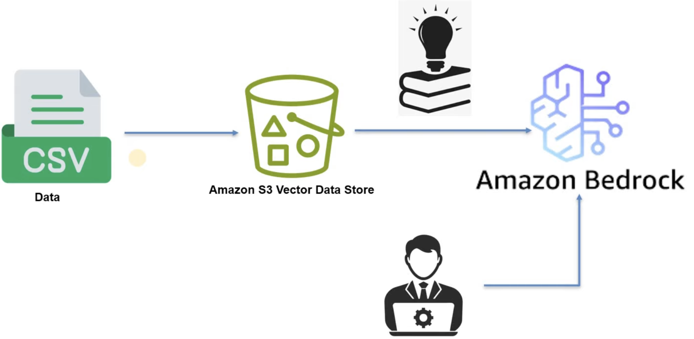
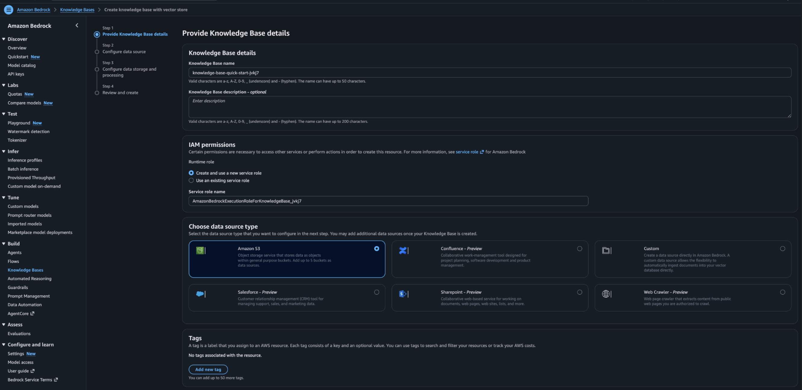
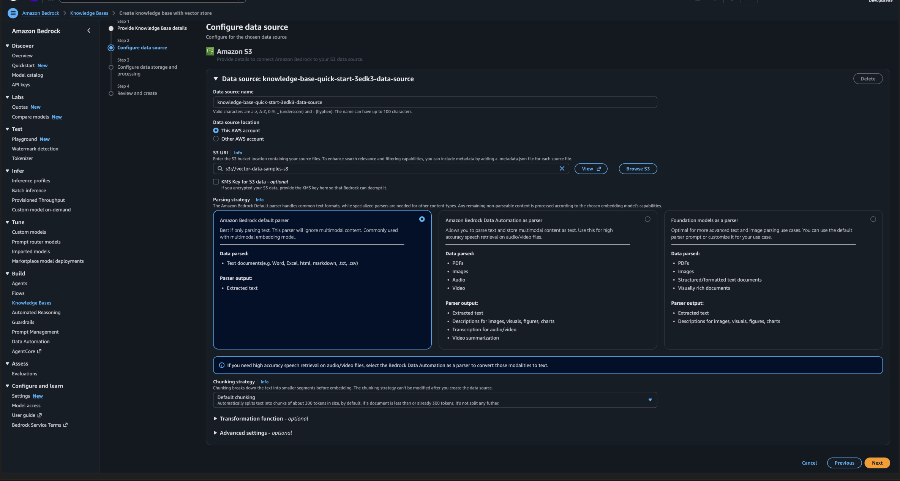
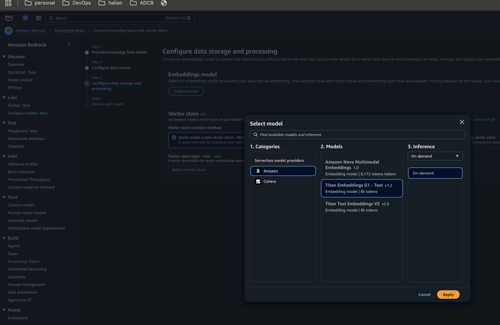
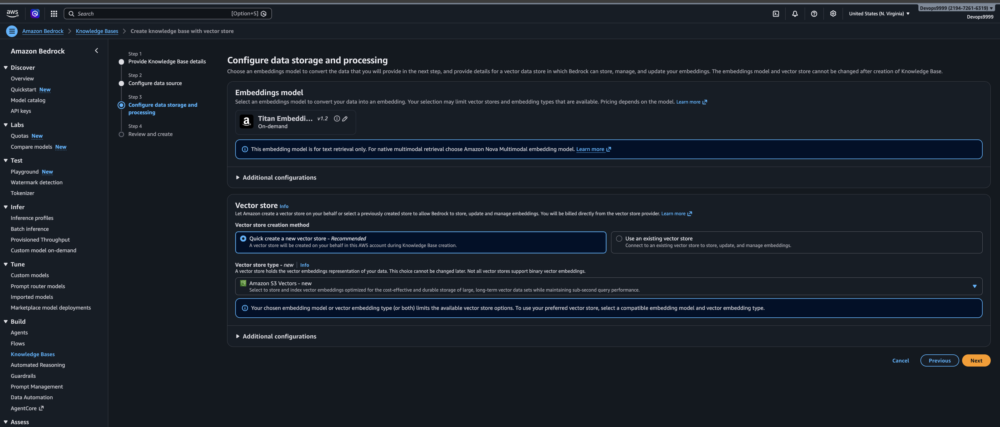
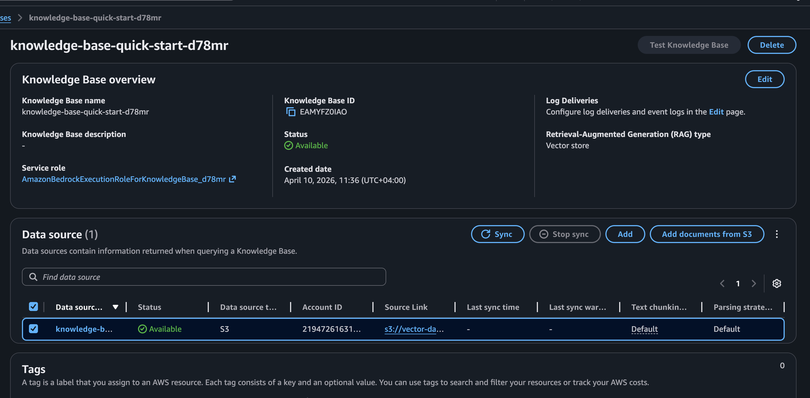
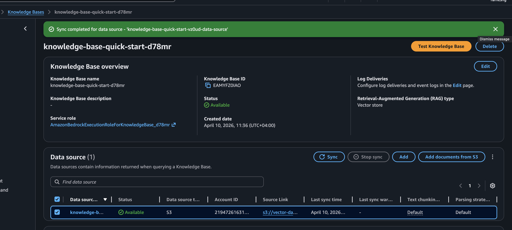
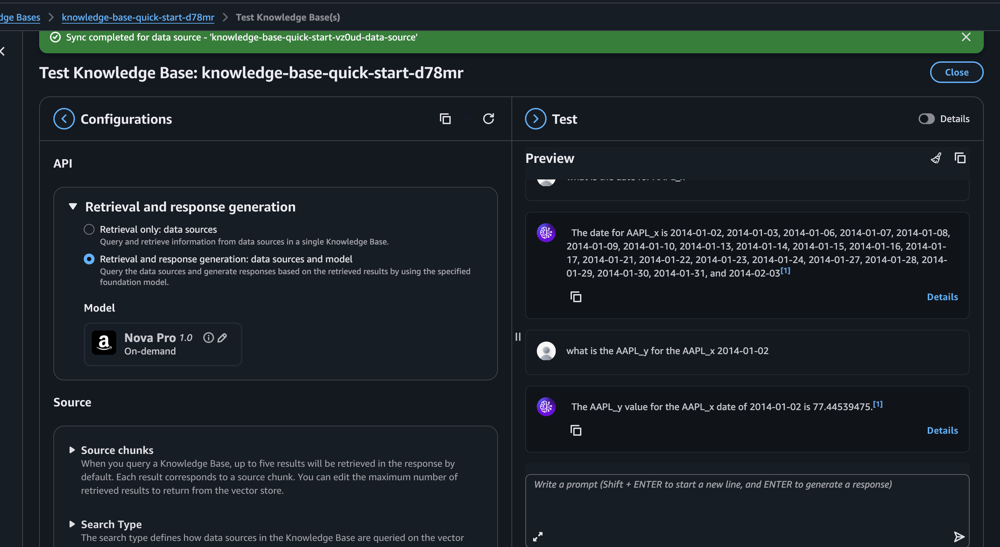

# AWS Bedrock RAG with S3 Vector Store

This project demonstrates a Retrieval-Augmented Generation (RAG) workflow using Amazon Bedrock Knowledge Bases and Amazon S3 as the data source. The solution ingests CSV files stored in S3, indexes them through a Bedrock Knowledge Base, retrieves relevant content at query time, and generates grounded responses using an LLM.

## What makes it RAG

- RAG happens because the LLM is not answering from memory alone; it first retrieves relevant chunks from the indexed S3 content, then uses that retrieved context to generate the final response. That is exactly why the answers become data-specific and more grounded in the uploaded CSV content
  
## Architecture

- Flow: CSV files in S3 → Bedrock Knowledge Base → embeddings/vector index → retrieval → LLM response

## Implementation steps

### Data is uploaded to an S3 bucket

- Create S3 bucket
- Upload the data to s3 bucket present in directory vector-data

## Amazon Bedrock Knowledge Base is created with a vector store

- Bedrock > build > knowledge bases > create > knowledge base with vector store.
  

- A data source is configured to read from S3.
  

- An embedding model is selected to convert content into vector representations.
  

- Select the Vector
  

- Sync the knowledge base to index the data.
  

- A foundation model is used to answer questions based on retrieved context.
  

- Select the LLM > apply

- create knowledge base.

## Test the knowledge base

